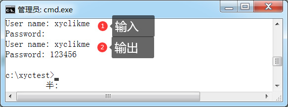
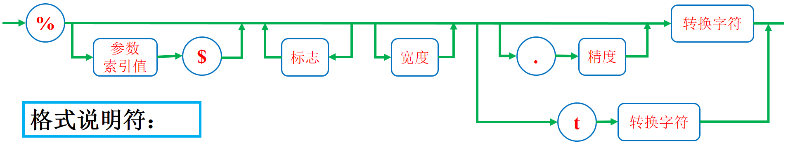
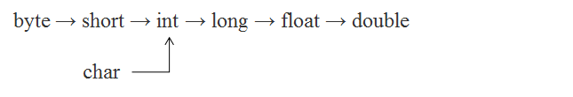
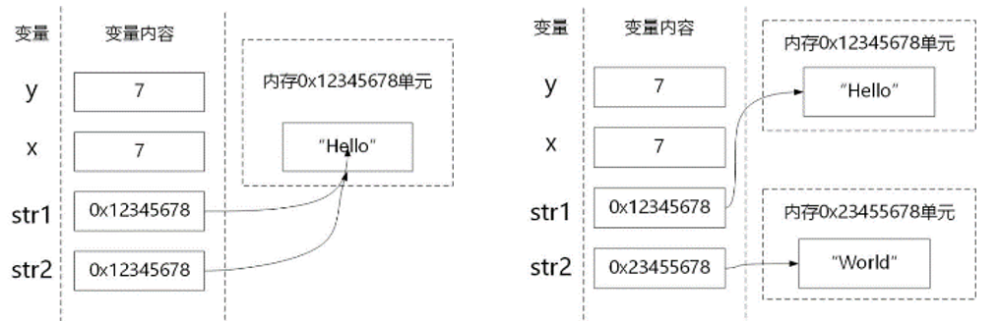

[TOC]


# Java基本规范

## 命名规范

(1)项目名全部小写。

(2)包名全部小写。

(3)类名首字母大写，如果类名由多个单词组成，每个单词的首字母都要大写。

```java
public class MyFirstClass{}
```

(4)变量名、方法名首字母小写，如果名称由多个单词组成，每个单词的首字母都要大写。

```java
int index = 0;
public void toString() {}
```

(5)常量名全部大写

```java
public static final String COLOR= "RED";
```

(6)所有命名规则遵循以下规则：

- 名称只能由字母、数字、下划线、$符号组成；

- 不能以数字开头；

- 名称不能使用Java中的关键字；

- 坚决不要出现中文及拼音命名。

 

## 注释规范

(1)类注释：在类前使用

```java
/**
 * 类的详细说明
 * @author 类创建者姓名
 * @Date 创建日期
 * @version 1.0
 */
```

(2)属性注释：在属性前使用

```java
/** 提示信息 */
```

(3)方法注释：在方法前使用

```java
/**
 * 类方法的详细使用说明
 * @param 参数1 参数1的使用说明
 * @return 返回结果的说明
 * @throws 异常类型.错误代码 注明从此类方法中抛出异常的说明
 */
```

(4)构造方法注释：在构造方法前使用

```java
/**
 * 构造方法的详细使用说明
 * @param 参数1 参数1的使用说明
 * @throws 异常类型.错误代码 注明从此类方法中抛出异常的说明
 */
```

(5)方法内部注释：

在方法内部使用单行或者多行注释，该注释根据实际情况添加。

 

## 常用的文档注释标签

| 标签        | 描述                       | 标签       | 描述                   |
| ----------- | -------------------------- | ---------- | ---------------------- |
| @author     | 说明类或接口的作者         | @exception | 说明方法所抛出的异常类 |
| @deprecated | 说明类、接口或成员已经废弃 | @throws    | 同@exception标签       |
| @param      | 说明方法参数(自动)         | @version   | 类或接口的版本         |
| @return     | 说明返回值(自动)           | @since     | 方法、属性的开始版本   |
| @see        | 参考另一个主题的链接       | @code      | 等宽代码               |


# Java基础

## 常用单词

| 单词   | 解释             | 单词   | 解释                   |
| ------ | ---------------- | ------ | ---------------------- |
| args   | [计]参数         | class  | n.阶级；班级；种类；类 |
| system | n.制度；系统     | main   | adj.主要的；[计]主方法 |
| out    | adv.出去         | print  | v./n.打印              |
| public | adj.公共的       | static | adj.静态的             |
| void   | adj.空的；无效的 | string | n.一串；字符串         |


## 简单的Java程序代码说明

(1)保存由PSVM创建的主函数main()的类叫主类。

```java
public static void main(String[] args) {}
```

```java
System.out.print(…); // 不换行
System.out.println(…); // 换行
```

> PSVM定义的main()方法
>
> (1)PSVM定义的main方法，不需要对任何对象进行操作，事实上，程序启动的时候还没有任何对象；
>
> (2)每个类都可以有PSVM定义的main()方法，不影响其他类对该类的方法调用。

 

## Scanner类

### 简单的示例

```java
// 1.导入Scanner类
import java.util.Scanner;
public class ScanTest {
    public static void main(String[] args) {
        // 2.创建扫描器对象，System.in表示从键盘获取
        Scanner scan = new Scanner(System.in);
        // 3.调用方法获取一个整数
        int num = scan.nextInt();
        System.out.println(num * 2);
        // 4.关闭扫描器对象
        scan.close();
    }
}
```

### 解释

(1)导包：`java.util.Scanner`

```java
import java.util.Scanner;
```

(2)创建从键盘获取的扫描器对象：

```java
Scanner scan = new Scanner(System.in);
```

(3)关闭扫描器对象：

```java
scan.close();
```

### Scanner类常用方法

| 方法           | 说明                               | 方法        | 说明          |
| -------------- | ---------------------------------- | ----------- | ------------- |
| **next()**     | 获取String类型(空格结束，后面截断) | nextByte()  | 获取byte类型  |
| nextInt()      | 获取int类型                        | nextFloat() | 获取float类型 |
| nextBoolean()  | 获取boolean类型                    | nextShort() | 获取short类型 |
| nextDouble()   | 获取double类型                     | nextLong()  | 获取long类型  |
| **nextLine()** | 获取输入的一行字符串(回车结束)     |             |               |

### 获取char类型

Scanner类没有获取char类型的，如果非要是char类型，只能是先获取String类型，使用`charAt(index)`获取指定位置的字符。

```java
// 获取输入的第一个字符
Scanner scan = new Scanner(System.in);
String str = scan.next();
char c = str.charAt(0);
System.out.println(c);
scan.close();
```

### 密码输入

(1)Scanner类的输入是可见的，所以不适合从控制台读取密码。

(2)JavaSE6引入了`java.io.Console`类实现了这个目的，但是Console类对象处理输入不如Scanner类方便，Console类每次只能读取一行输入，没有读取一个单词或者一个数值的方法。

(3)`java.io.Console`只能用在标准输入、输出流未被重定向的原始控制台中使用，在Eclipse或其他IDE控制台是用不了的。

```java
Console cons = System.console();
String username = cons.readLine("User name: ");
char[] passwd = cons.readPassword("Password: ");
String password = new String(passwd); // 将字符数组转换为字符串
System.out.println("User name: " + username);
System.out.println("Password: " + password);
```




## 格式化输出

```java
System.out.printf("格式说明符", 值…);
```



```java
% - 0 m.n l或h 转换字符
```

### printf的标志

| 标志            | 目的                                                         | 举例        |
| --------------- | ------------------------------------------------------------ | ----------- |
| +               | 打印正数和负数的符号                                         | +33.33      |
| 空格            | 在正数之前添加空格                                           | \|  33.33\| |
| 0               | 数字前面补0                                                  | 0033.33     |
| -               | 左对齐                                                       | \|3.333 \|  |
| (               | 将负数括在括号内                                             | (  33.33 )  |
| ,               | 添加分组分隔符                                               | 3,333.33    |
| #(对于f格式)    | 包含小数点                                                   | 3,33.       |
| #(对于x或o格式) | 添加前缀0x或0                                                | 0xcafe      |
| $               | 给定被格式化的参数索引；<br />`%1$d,%1$x`将以十进制和十六进制格式打印第一个参数 | 159  9F     |
| <               | 格式化前面说明的数值；<br />`%d%<x`将以十进制和十六进制打印同一个数值 | 159 9F      |

### 标志的说明

- %：表示格式说明的起始符号，不可缺少。

- -：有-表示左对齐输出，如省略表示右对齐输出。

- 0：有0表示指定空位填0，如省略表示指定空位不填。

- m.n：m指域宽，对应输出项在输出设备上所占的字符数。n指精度，说明输出实型数的小数位数。未指定n时，隐含的精度为n=6位。

- l或h：l对整型指long型，对实型指double型；h用于将整型的格式字符修正为short型。

### printf的转换符

| 转换符 | 类型             | 用法                                                         | 举例       |
| ------ | ---------------- | ------------------------------------------------------------ | ---------- |
| d      | 十进制整数       | %d：按整型数据的实际长度输出；<br />%md：m为指定的输出字段的宽度，数据的位数小于m，则左端补以空格，若大于m，则按实际位数输出；<br />%ld：输出长整型数据。 | 159        |
| x      | 十六进制整数     | 长整型%lx格式输出，指定字段宽度用%mx                         | 9f         |
| o      | 八进制整数       | 长整型%lo格式输出，指定字段宽度用%mo                         | 237        |
| u      | 无符号十进制整数 | 长整型%lu格式输出，指定字段宽度用%mu                         |            |
| f      | 定点浮点数       | %f：不指定宽度，整数部分全部输出并输出6位小数；<br />%m.nf：输出共占m位，n位小数，数值宽度小于m左端补空格；<br />%-m.nf：输出共占m位，n位小数，数值宽度小于m右端补空格。 | 15.9       |
| e      | 指数浮点数       | 与f格式类似                                                  | 1.59e+1    |
| g      | 通用浮点数       | 自动选f格式或e格式中较短的一种输出，且不输出无意义的零       | -          |
| a      | 十六进制浮点数   |                                                              | 0x1.ddp30  |
| s      | 字符串           |                                                              | Hello      |
| c      | 字符             |                                                              | H          |
| b      | 布尔值           |                                                              | true       |
| h      | 散列码           |                                                              | 42628b2    |
| %      | 百分号           | 输出字符%，用连续两个%表示                                   | %          |
| n      | 换行             |                                                              | 与平台有关 |


## Java开发工具包JDK

- javac：Java编译器，编译成.class文件

- java：Java虚拟机

- javadoc：Java文档生成器

- jar：Java归档打包程序

- appletviewer：Java小应用程序查看器

- JavaAPI
- jre = JVM + JavaAPI


## Java的标识符命名规则

(1)标识符的长度不限，可以包含Unicode字符集中的任意字母和数字，但是不能以数字开头。

(2)标识符不能包含标点符号，但是可以是下划线(_)和美元符号($)，以及Unicode字符集中的其他货币符号，例如￡和¥。

> 关于货币符号$：货币符号主要用于自动生成的源码中，应当避免使用。


## Java保留字

| 保留字   |         |            |              |           |
| -------- | ------- | ---------- | ------------ | --------- |
| abstract | default | goto       | package      | this      |
| assert   | do      | if         | private      | throw     |
| boolean  | double  | implements | proteced     | throws    |
| break    | else    | import     | public       | transient |
| byte     | enum    | instanceof | return       | true      |
| case     | extends | int        | short        | try       |
| catch    | false   | interface  | static       | void      |
| char     | final   | long       | strictfp     | volatile  |
| class    | finally | native     | super        | while     |
| const    | float   | new        | switch       |           |
| continue | for     | null       | synchronized |           |


## 变量的定义

Java中变量必须先声明、赋值，再访问！

(1)定义一个变量，不初始化：

```java
double num;
```

(2)定义多个同类型变量，不初始化：

```java
int i, j;
```

(3)定义一个变量，并初始化(**推荐**)：当初始值不确定的时候，设置默认值为0或者false等。

```java
int num = 2;
```

(4)定义多个同类型变量，并初始化：

```java
int a = 1, b = 2;
```


## 变量的访问

### 写入数据

(1)从键盘输入数据：

```java
import java.util.Scanner;  // 导入包
public class JavaDemo {
    public static void main(String[] args) {
        // 创建键盘扫描器对象sc 
        Scanner sc = new Scanner(System.in);  
        int x = sc.nextInt(); // 输入数据,并存在x中
        System.out.println(x * x);
        sc.close(); // 关闭扫描器对象
    }
}
```

(2)使用赋值号写入数据：

```java
x = x + 1;
```

(3)定义时初始化：

```java
int y = 123;
```

### 读出数据

(1)变量当参数参与运算时自动读取：

```java
x = 25;
x = x + 5; // 右边的x为自动读入
```

(2)使用输出语句访问数据：

```java
int a = 25;
System.out.println(a);
```


## 只读变量

定义语法：

```java
[权限修饰符] final 数据类型 常量名 = 值;
```

```java
/**
 * 定义一个属性
 */
private final int COLOR = 10;
```

更多详细信息参见[final](#final)关键字。


## 初始化

(1)成员变量的初始值：

- 整数型(byte、short、int和long)：默认值为0。

- 单精度浮点型(float)：默认值为0.0f。

- 双精度浮点型(double)：默认值为0.0d。

- 字符型(char)：默认值为\u0000。

- 布尔型：默认值为false。

- 数组等引用类型：默认值为null。

(2)本地变量的初始值：本地变量不初始化就会报错。


## 注释

(1)单行注释：

```java
// 注释内容
```

(2)多行注释：

```java
/*
 * 注释内容
 */
```

(3)文档注释：

```java
/**
 * 注释内容
 */
```

注：尽量使用单行注释，文档注释参考前面的Java规范。


## Java编码

Java使用十六进制的Unicode编码。


## Java在cmd的常用命令

Windows中文版默认的编码是GBK，所以不需要指定编码。

(1)编译`*.java`文件为`*.class`文件

- GBK编码文件

```bash
javac *.java
```

- UTF-8编码文件

```bash
javac -encoding "UTF-8" *.java
```

(2)执行`*.class`文件

```bash
java 类名
```

(3)文档生成javadoc文件

```bash
javadoc [参数] 源文件.java
```

- GBK编码文件

```bash
javadoc -d 文档存放目录及文件名 [-author] [-version] 源文件名.java
```

- UTF-8编码文件

```bash
javadoc -encoding "UTF-8" -d 文档存放目录及文件名 [-author] [-version] 源文件名.java
```


# Java数据类型

## 常见单词

| 单词   | 解释                         | 单词      | 解释                             |
| ------ | ---------------------------- | --------- | -------------------------------- |
| byte   | n.字节                       | short     | adj.短的                         |
| int    | abbr.整数                    | integer   | n.整数                           |
| long   | adj.长的；过长的             | float     | v.浮动；[计]单精度浮点数         |
| double | adj.双倍的；[计]双精度浮点数 | boolean   | adj.布尔数学体系的；[计]布尔类型 |
| char   | abbr.[计]字符类型            | character | n.性格；特点；[计]字符；文字     |


## 基本数据类型

基本类型表示简单的数据，基本类型分为4大类，共8种数据类型。

(1)整数类型：byte、short、int和long

(2)浮点类型：float和double

(3)字符类型：char

(4)布尔类型：boolean


## 整数类型

| 整数类型 | 宽度    | 取值范围       |
| -------- | ------- | -------------- |
| byte     | 1个字节 | -128~127(记住) |
| short    | 2个字节 | -215~215-1     |
| int      | 4个字节 | -231~231-1     |
| long     | 8个字节 | -263~263-1     |

(1)一个字节：8位，存储位数28。

(2)Java语言的整型类型默认是int类型，即输入的所有整数都是int。

(3)long类型必须在数值后面加l或L。

> 关于Java基础数据类型的说明
>
> (1)Java语言的整数类型都是有符号格式。
>
> (2)Java语言的存储宽度是固定的，与操作系统及硬件无关，目的是跨平台。


## 浮点类型

| 浮点类型             | 宽度            |
| -------------------- | --------------- |
| float(精确6-7位小数) | 4个字节（32位） |
| double(精确14位小数) | 8个字节（64位） |

(1)Java语言的浮点类型默认是double类型，例如0.0表示double类型常量，而不是float类型。

(2)如果想要表示float类型，则需要在数值后面加f或F。

(3)默认的double类型，可以直接写，也可以在数值的后面加上d或D。

> 浮点数比较大小：浮点数之间的等值判断，基本数据类型不能用==来比较，包装数据类型不能用equals来判断。

```java
float a = 0.8f - 0.7f;
float b = 0.9f - 0.8f;
float diff = 1e-6f;
if (Math.abs(a - b) < diff) {
    System.out.println("a == b");
}
```

(4)浮点数的十六进制表示法：

十六进制用大写或小写的p表示幂，尾数采用十六进制，指数采用十进制，指数的基数是2，而不是10，如0xap3用十进制表示为：10×2^3。

```java
double b = 0x1p-1; // 1*2^(-1)
System.out.println(b); // 0.5
double c = 0xaP3; // 10*2^3
System.out.println(c); // 80.0
```


## 整数进制

(1)二进制数：以0b或0B为前缀。

(2)八进制数：以0为前缀，Python是0o为前缀(不推荐使用，如010表示8，容易和二进制混淆)。

(3)十六进制数：以0x或0X为前缀。

> **数字字面量的表示**：从Java7开始，数字字面量可以加下划线，如1_000_000表示100万，这些下划线只是为了易读，Java编译器会去除这些下划线。


## 指数表示(科学计数法)

十进制用大写或小写的e表示幂，e2表示10^2。

```java
double myMoney = 3.36e2;
double interestRate = 1.56e-2;
```

> e或者E的前后不能有空格。


## 字符类型及编码

| 字符类型 | 宽度          |
| -------- | ------------- |
| char     | 2个字节(16位) |

Java中char声明字符类型，Java中的字符常量必须用单引号括起来的单个字符，如下所示：

```java
char c = 'A';
```

Java字符采用双字节Unicode编码，占两个字节，因而可用十六进制编码形式表示，它们的表现形式是`\un`，其中n为16位十六进制数，所以'A'字符也可以用Unicode编码`'\u0041'`表示。

(1)基本说明：
- 字符类型也属于是数值类型，可以与int等数值类型进行数学计算或进行转换。这是因为字符类型在计算机中保存的是Unicode编码，双字节Unicode的存储范围在`\u0000~\uFFFF`，所以char类型取值范围0~2^(16-1)。
- 汉字也是一个字符。
- 英文字母大写与小写编码相差32。

(2)常用字符的范围：
- 大写字母范围：65(A)~90(Z)。
- 小写字母范围：97(a)~122(z)，大写字母和小写字母之间差了32。
- 字符范围：48(0)~57(9)。

> 关于转义序列的说明：Unicode转义序列会在解析代码之前得到处理，如`"\u0022+\u0022"`并不是(U+0022)包围的字符串，实际上`\u0022`会被解析成`"`，这使得`"\u0022+\u0022"`解析成`""+""`，得到一个空串。


## 转义字符

| 字符表示 | Unicode | 编码说明      |
| -------- | ------- | ------------- |
| \\t      | \\u0009 | 水平制表符tab |
| \\n      | \\u000a | 换行          |
| \\r      | \\u000d | 回车          |
| \"       | \\u0022 | 双引号        |
| \'       | \\u0027 | 单引号        |
| \\       | \\u005c | 反斜线        |

(1)下面的语句会产生一个错误，因为`\u000a`会被解释为回车：

```java
System.out.println(12+"\u000a"+12);
```

此时语句相当于是：

```java
System.out.println(12+"
                "+12);
```

(2)正确写法：

```java
System.out.println("Hello"+\u000a"World");
```

- World前面不能再使用+连接；

- 输出：HelloWorld，没有回车换行输出！

- 在转义字符的字符表示和Unicode表示中，优先使用字符表示；

- 在任何地方看到`\u`都要特别注意，即使是在代码的注释中。

```java
// 正确写法：\\users
// 错误写法：\users
```

错误原因：`\u`的后面未跟着4个十六进制数。


## 布尔类型

在Java语言中声明布尔类型的关键字是boolean，它只有两个值：true和false。

> 关于boolean值的说明：
>
> (1)在C、Python等语言中布尔类型是数值类型，它有两个取值：1和0。而在Java中的布尔类型取值不能用1和0替代，也不属于数值类型，不能与int等数值类型之间进行数学计算或类型转化。
>
> (2)编写返回boolean值的方法时，方法名采用is开头，如：`public boolean isNumber(){}`


## 自动类型转换

自动类型转换就是需要类型之间转换是自动的，不需要采取其他手段，总的原则是小范围数据类型可以自动转换为大范围数据类型，下列转换从左到右是自动。




## 强制类型转换

语法：注意**数据类型一定要加小括号**。

```java
(数据类型) 操作数;
(数据类型) (操作数);
```

```java
int a = 1230; // 把int变量a强制转换为byte  
byte b = (byte)a;
System.out.println(b); // 输出：-50
```


## 引用数据类型

(1)引用类型包括：类、接口、数组

(2)引用数据类型实例

```java
int x = 7;
int y = x;
String str1 = "Hello";
String str2 = str1;
str2 = "World";
```

(3)图解：




## 引用传递

(1)核心：同一块堆内存可以被不同栈内存所指向，**不同栈内存可以对同一堆内存进行内容修改**。

(2)在Java中，只有一种传递方式：值传递。

(3)值：地址值和基本数据类型。


# 运算符与表达式

## 一元运算符

| 运算符  | 名称                       | 示例     |
| ------- | -------------------------- | -------- |
| -取反符 | 取反运算                   | b=-a     |
| ++自增1 | 先取值再加1，或先加1再取值 | a++或++a |
| --自减1 | 先取值再减1，或先减1再取值 | a--或--a |

(1)++运算法的使用

```java
int n = 10;
System.out.println(n++); // 输出：10
System.out.println(n); // 输出：11
```

(2)n++与++n的说明：

- ++写在前面和后面计算结果是不同的，++n表示先加1再引用n，n++表示先引用n再加1。

- 在算数运算表达式中，尽量不要去使用。

- ++与--运算符会改变变量的值，所以他们的操作数不能是数值，例如4++就是错误的语句。


## 二元运算符

| 运算符 | 名称说明                                           | 例子 |
| ------ | -------------------------------------------------- | ---- |
| +加    | 求a加b的和，还可用于String类型，进行字符串连接操作 | a+b  |
| -减    | 求a减b的差                                         | a-b  |
| *乘    | 求a乘以b的积                                       | a*b  |
| /除    | 求a除以b的商                                       | a/b  |
| %取余  | 求a除以b的余数                                     | a%b  |

> 关于除数是0的说明：
>
> (1)整数被0除会产生异常，而浮点数被0除会得到无穷大(Infinity)或NaN结果；
>
> (2)若n是浮点数，n / 0的结果是：
>
> - NaN：n = 0.0
>
> - Infinity：n > 0.0
>
> - -Infinity：n < 0.0
>
> (3)整数的除法对于除数为0时运行时将报错，但编译不会报错。

> 关于NaN的说明：
>
> (1)所有的NaN值都认为是不相同的。
>
> (2)判断一个值是否是NaN可以用`Double.isNaN(x`)或`Float.isNaN(x)`方法。

```java
public static boolean isNaN(double x) {
    return (x != x);
}
```


## 赋值运算符

| 运算符 | 名称     | 例子               | 解释                       |
| ------ | -------- | ------------------ | -------------------------- |
| +=     | 加赋值   | a += b、a += b + 3 | a = a + b、a = a + (b + 3) |
| -=     | 减赋值   | a -= b             | a = a - b                  |
| *=     | 乘赋值   | a *= b             | a = a * b                  |
| /=     | 除赋值   | a /= b             | a = a / b                  |
| %=     | 取余赋值 | a %= b             | a = a % b                  |

(1)Java支持连续赋值

```java
int num = 3;
int num1 = 4;
int num2 = num1 = num;
System.out.println(num1); // num1=3
System.out.println(num2); // num2=3
```

(2)赋值差距

```java
short s1 = 10;
s1 = s1 + 2; // 编译失败，2为int类型
short s2 = 10;
s2 += 2; // 编译通过，存在隐式的强制类型转换
```

原因：**增强赋值包含隐式强制类型转换**，不会改变原本数据类型，所以推荐使用增强赋值。

(3)连续赋值与增强赋值的共同运用

```java
int a, b, c;
a = b = c = 4;
a += b += c;
System.out.println("a = " + a); // 12  从右向左：a += b，a = a + b = 12
System.out.println("b = " + b); // 8   从右向左：b += c，b = b + c = 8
System.out.println("c = " + c); // 4   从右向左：c = 4
```


