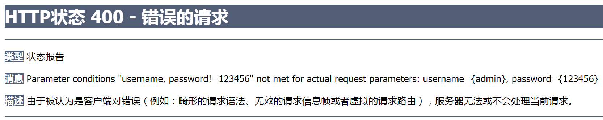

# 1. SpringMVC简介

## 1.1 什么是MVC？

(1)MVC是一种软件架构的思想，将软件按照模型、视图、控制器来划分。

(2)M：Model，模型层，指工程中的JavaBean，作用是处理数据。

> JavaBean分为两类：
>
> - 一类称实体类Bean：专门存储业务数据的，如Student、User等；
> - 一类称业务处理Bean：指Service或Mapper对象，专门用于处理业务逻辑和数据访问。

(3)V：View，视图层，指工程中的html或jsp等页面，作用是与用户进行交互，展示数据。

(4)C：Controller，控制层，指工程中的servlet，作用是接收请求和响应浏览器。

(5)MVC的工作流程：

- 用户通过视图层发送请求到服务器；
- 在服务器中请求被Controller接收，Controller调用相应的Model层处理请求；
- 处理完毕将结果返回到Controller；
- Controller再根据请求处理的结果找到相应的View视图，渲染数据后最终响应给浏览器。


## 1.2 什么是SpringMVC
(1)SpringMVC是Spring的一个后续产品，是Spring的一个子项目。

(2)SpringMVC是Spring为表述层开发提供的一整套完备的解决方案。在表述层框架历经Strust、WebWork、Strust2等诸多产品的历代更迭之后，目前业界普遍选择了SpringMVC作为JavaEE项目表述层开发的首选方案。

> 三层架构分为表述层(或表示层)、业务逻辑层、数据访问层，表述层表示前台页面和后台servlet。


## 1.3 SpringMVC的特点

SpringMVC的特点主要有：
- Spring家族原生产品，与IOC容器等基础设施无缝对接；
- 基于原生的Servlet，通过了功能强大的前端控制器DispatcherServlet，对请求和响应进行统一处理；
- 表述层各细分领域需要解决的问题全方位覆盖，提供全面解决方案；
- 代码清新简洁，大幅度提升开发效率；
- 内部组件化程度高，可插拔式组件即插即用，想要什么功能配置相应组件即可；
- 性能卓著，尤其适合现代大型、超大型互联网项目要求。


# 2. 入门案例

## 2.1 开发环境

- idea：IntelliJ IDEA 2018.1.5 x64
- 构建工具：maven3.6.3
- 服务器：tomcat 8.5.65
- Spring版本：5.3.1
- 其他：thymeleaf


## 2.2 创建Maven工程


## 2.3 pom.xml

(1)使用idea创建maven工程时，如果没有使用模板，可能需要手动添加打包方式。

```xml
<packaging>war</packaging>
```

- war：表示这是一个web工程；
- jar：表示这是一个简单java工程。

(2)添加依赖：见完整代码。

(3)完整代码：

```xml
<?xml version="1.0" encoding="UTF-8"?>
<project xmlns="http://maven.apache.org/POM/4.0.0"
         xmlns:xsi="http://www.w3.org/2001/XMLSchema-instance"
         xsi:schemaLocation="http://maven.apache.org/POM/4.0.0
         http://maven.apache.org/xsd/maven-4.0.0.xsd">
    <modelVersion>4.0.0</modelVersion>
    <groupId>com.xyc</groupId>
    <artifactId>springMVC</artifactId>
    <version>1.0-SNAPSHOT</version>
    <!-- 添加打包方式 -->
    <packaging>war</packaging>

    <dependencies>
        <!-- SpringMVC -->
        <dependency>
            <groupId>org.springframework</groupId>
            <artifactId>spring-webmvc</artifactId>
            <version>5.3.1</version>
        </dependency>
        <!-- 日志 -->
        <dependency>
            <groupId>ch.qos.logback</groupId>
            <artifactId>logback-classic</artifactId>
            <version>1.2.3</version>
        </dependency>
        <!-- ServletAPI -->
        <dependency>
            <groupId>javax.servlet</groupId>
            <artifactId>javax.servlet-api</artifactId>
            <version>3.1.0</version>
            <scope>provided</scope>
        </dependency>
        <!-- Spring5和Thymeleaf整合包 -->
        <dependency>
            <groupId>org.thymeleaf</groupId>
            <artifactId>thymeleaf-spring5</artifactId>
            <version>3.0.12.RELEASE</version>
        </dependency>
    </dependencies>
</project>
```


## 2.4 HelloController.java

(1)请求控制器：虽然前端控制器对浏览器发送的请求进行了统一的处理，但是具体的请求有不同的处理过程，因此需要创建处理具体请求的类，即请求控制器。

(2)请求控制器中的方法：请求控制器中每一个处理请求的方法成为控制器方法。

(3)请求控制器的创建方式：因为SpringMVC的控制器由一个POJO(普通的Java类)担任，因此需要通过@Controller注解将其标识为一个控制层组件，交给Spring的IoC容器管理，此时SpringMVC才能够识别控制器的存在。

```java
package com.xyc.controller;

import org.springframework.stereotype.Controller;
import org.springframework.web.bind.annotation.RequestMapping;

@Controller
public class HelloController {
    @RequestMapping("/") // 设置请求的路径
    public String indexController() {
        // 设置视图名称
        return "index"; // 跳转到index页面
    }

    @RequestMapping("/hello")
    public String hello() {
        return "target"; // 跳转到target页面
    }
}
```


## 2.5 web.xml

```xml
<?xml version="1.0" encoding="UTF-8"?>
<web-app xmlns="http://xmlns.jcp.org/xml/ns/javaee"
         xmlns:xsi="http://www.w3.org/2001/XMLSchema-instance"
         xsi:schemaLocation="http://xmlns.jcp.org/xml/ns/javaee
         http://xmlns.jcp.org/xml/ns/javaee/web-app_4_0.xsd"
         version="4.0">

    <!-- 配置SpringMVC的前端控制器，对浏览器发送的请求统一进行处理 -->
    <servlet>
        <servlet-name>springMVC</servlet-name>
        <servlet-class>org.springframework.web.servlet.DispatcherServlet</servlet-class>
        <!-- 通过初始化参数指定SpringMVC配置文件的位置和名称 -->
        <init-param>
            <!-- contextConfigLocation为固定值 -->
            <param-name>contextConfigLocation</param-name>
            <!-- classpath:表示从类路径查找，例如maven工程中的src/main/resources -->
            <param-value>classpath:springMVC.xml</param-value>
        </init-param>
        <!-- 初始化时间提前到服务器启动时 -->
        <load-on-startup>1</load-on-startup>
    </servlet>
    <servlet-mapping>
        <servlet-name>springMVC</servlet-name>
        <!-- 设置前端控制器的能处理的请求路径 -->
        <url-pattern>/</url-pattern>
    </servlet-mapping>
</web-app>
```

(1)设置前端控制器初始化的时间：DispatcherServlet作为框架的核心组件，在启动过程中有大量的初始化操作要做，而这些操作放在第一次请求时才执行会严重影响访问速度，因此需要通过`<load-on-startup>`标签将初始化时间提前到服务器启动时。

```xml
<!-- 初始化时间提前到服务器启动时 -->
<load-on-startup>1</load-on-startup>
```

(2)请求路径：设置SpringMVC的核心控制器所能处理的请求的请求路径

- **/**所匹配的请求可以是/login或.html或.js或.css方式的请求路径；
- 但是**/**不能匹配**.jsp**请求路径的请求。

> 在真实的开发时，首先要配置编码过滤器，防止出现post请求中文乱码。而get请求的中文乱码在tomcat服务器的配置文件server.xml中设置。


## 2.6 index.html

(1)添加thymeleaf名称空间：

```html
<html lang="en" xmlns:th="http://www.thymeleaf.org">
```

(2)完整代码：

```html
<!DOCTYPE html>
<html lang="en" xmlns:th="http://www.thymeleaf.org">
<head>
    <meta charset="UTF-8">
    <title>index页面</title>
</head>
<body>
    <a th:href="@{/hello}">HelloWorld</a><br/>
</body>
</html>
```


## 2.7 springMVC.xml

```xml
<?xml version="1.0" encoding="UTF-8"?>
<beans xmlns="http://www.springframework.org/schema/beans"
       xmlns:xsi="http://www.w3.org/2001/XMLSchema-instance"
       xmlns:context="http://www.springframework.org/schema/context"
       xsi:schemaLocation="http://www.springframework.org/schema/beans
       http://www.springframework.org/schema/beans/spring-beans.xsd
       http://www.springframework.org/schema/context
       http://www.springframework.org/schema/context/spring-context.xsd">
    <!-- 自动扫描包 -->
    <context:component-scan base-package="com.xyc.controller"/>
    <!-- 配置Thymeleaf视图解析器 -->
    <bean id="viewResolver" class="org.thymeleaf.spring5.view.ThymeleafViewResolver">
        <property name="order" value="1"/>
        <property name="characterEncoding" value="UTF-8"/>
        <property name="templateEngine">
            <bean class="org.thymeleaf.spring5.SpringTemplateEngine">
                <property name="templateResolver">
                    <bean class="org.thymeleaf.spring5.templateresolver.SpringResourceTemplateResolver">
                        <!-- 视图前缀 -->
                        <property name="prefix" value="/WEB-INF/templates/"/>
                        <!-- 视图后缀 -->
                        <property name="suffix" value=".html"/>
                        <property name="templateMode" value="HTML5"/>
                        <property name="characterEncoding" value="UTF-8"/>
                    </bean>
                </property>
            </bean>
        </property>
    </bean>
</beans>
```


## 2.8 项目启动

创建Tomcat运行实例，启动项目。


## 2.9 总结

(1)浏览器发送请求，若请求地址符合前端控制器的url-pattern，该请求就会被前端控制器DispatcherServlet处理。

(2)前端控制器会读取SpringMVC的核心配置文件，通过扫描组件找到控制器，将请求地址和控制器中@RequestMapping注解的value属性值进行匹配。

(3)若匹配成功，该注解所标识的控制器方法就是处理请求的方法。

(4)处理请求的方法需要返回一个字符串类型的视图名称，该视图名称会被视图解析器解析，加上前缀和后缀组成视图的路径，通过Thymeleaf对视图进行渲染，最终**转发**到视图所对应页面。


# 3. @RequestMapping

## 3.1 基础

(1)功能：

@RequestMapping的作用就是将**请求**和**处理请求的控制器方法**关联起来，建立映射关系。SpringMVC接收到指定的请求，就会来找到在映射关系中对应的控制器方法来处理这个请求。

(2)@RequestMapping的位置：

- 标识一个类：设置映射请求的请求路径的**初始信息**。

- 标识一个方法：设置映射请求请求路径的**具体信息**。

```java
@Controller
@RequestMapping("/test")
public class RequestMappingController {
    // 此时请求映射所映射的请求的请求路径为：/test/testRequestMapping
    @RequestMapping("/testRequestMapping")
    public String testRequestMapping() {
        return "success";
    }
}
```


## 3.2 value属性

(1)作用：@RequestMapping注解的value属性通过**请求地址匹配请求映射**。

(2)类型：@RequestMapping注解的value属性是一个**字符串类型的数组**，表示该请求映射能够匹配多个请求地址所对应的请求。

(3)说明：@RequestMapping注解的value属性**必须设置**，至少通过请求地址匹配请求映射。

```java
@RequestMapping(value = {"/testRequestMapping", "/test"})
public String testRequestMapping() {
    return "success";
}
```


## 3.3 method属性

(1)作用：@RequestMapping注解的method属性通过**请求方式匹配请求映射**。

(2)类型：@RequestMapping注解的method属性是一个RequestMethod类型的数组，表示该请求映射能够匹配多种请求方式的请求。

(3)说明：若当前请求的请求地址满足请求映射的value属性，但是请求方式不满足method属性，则浏览器报错405：Request method 'POST' not supported。

> 不设置method属性表示所有请求方式都能匹配，设置后表示只能匹配该请求方式。

```java
@RequestMapping(
        value = {"/testRequestMapping", "/test"},
        method = {RequestMethod.GET, RequestMethod.POST})
public String test() {
    return "success";
}
```

(4)@RequestMapping派生注解：对于处理指定请求方式的控制器方法，SpringMVC中提供了@RequestMapping的派生注解

- @GetMapping：处理get请求的映射；
- @PostMapping：处理post请求的映射；
- @PutMapping：处理put请求的映射；
- @DeleteMapping：处理delete请求的映射。

> 常用的请求方式：get、post、put、delete。
>
> - 目前浏览器只支持get和post，若在form表单提交时，为method设置了其他请求方式的字符串(put或delete)，则按照默认的请求方式get处理。
> - 若要发送put和delete请求，则需要通过Spring提供的过滤器HiddenHttpMethodFilter，参考[RESTful](#RESTful)部分。
> - 超链接`<a />`标签发送的是get请求。


## 3.4 params属性

(1)作用：@RequestMapping注解的params属性**通过请求参数匹配请求映射**。

(2)类型：@RequestMapping注解的params属性是一个字符串类型的数组，可以通过四种表达式设置请求参数和请求映射的匹配关系：

- "param"：要求请求映射所匹配的请求必须携带param请求参数。

- "!param"：要求请求映射所匹配的请求必须不能携带param请求参数。

- "param=value"：要求请求映射所匹配的请求必须携带param请求参数且param=value。

- "param!=value"：要求请求映射所匹配的请求必须携带param请求参数但是param!=value。

(3)小案例：

- 请求链接：

```html
<a th:href="@{/testParma(username='admin', password=123456)">请求参数</a>
```

- 地址栏获得的请求地址：

```text
http://localhost:8080/SpringMVC-test/testParma?username=admin&password=123456
```

- 请求映射：参数不满足

```java
@RequestMapping(
        value = "/testParma",
        method = {RequestMethod.GET, RequestMethod.POST},
        params = {"username", "password!=123456"})
public String testParma() {
    return "success";
}
```

(4)说明：若当前请求满足@RequestMapping注解的value和method属性，但是不满足params属性，此时页面回报错400：




## 3.5 headers属性(了解)

(1)作用：headers属性**通过请求头信息匹配请求映射**。

(2)类型：headers属性是一个字符串类型的数组，可以通过四种表达式设置请求头信息和请求映射的匹配关系：

- "header"：请求必须携带header请求头信息。

- "!header"：请求必须不能携带header请求头信息。

- "header=value"：请求必须携带header请求头信息且header=value。

- "header!=value"：请求必须携带header请求头信息且header!=value。

> 若当前请求满足@RequestMapping注解的value和method属性，但是不满足headers属性，此时页面显示404错误，即资源未找到。


## 3.6 模糊匹配

**模糊匹配**：SpringMVC支持ant风格的路径。

(1)可以使用以下全局模式和通配符来映射请求：

- ?：表示任意的单个字符。

- *：表示任意的0个或多个字符。

- \**：表示任意的0层或多层**目录**。

> 在使用\*\*时，只能使用**/\**/xxx**的方式(即字符\*\*的前后不能有字符)。

(2)示例：这个可以匹配例如/aa/test的请求。

```java
@RequestMapping("/a?/test")
public String test(){
    return "success";
}
```

(3)示例：这个时候，/\**aa/test与/\*aa/test是一样的，并不是表示多层路径。

```java
@RequestMapping("/**aa/test")
public String test() {
    return "success";
}
```

(4)示例：多层路径的匹配。此时/\*\*/test与\*\*/test是一样的，但是建议使用/\**/test。

```java
@RequestMapping("/**/test")
public String test() {
    return "success";
}
```


## 3.7 路径中的占位符

(1)原始方式传递参数：/testParma?username=admin&password=123456

```text
http://localhost:8080/SpringMVC-test/testParma?username=admin&password=123456
```

(2)RESTful方式：/testParma/admin/123456

SpringMVC支持路径中的占位符，SpringMVC路径中的占位符常用于RESTful风格中，当请求路径中将某些数据通过路径的方式传输到服务器中，就可以在相应的@RequestMapping注解的value属性中**通过占位符{xxx}表示传输的数据**，在通过@PathVariable注解，将占位符所表示的数据赋值给控制器方法的形参。

(3)小测试：

- html页面：

```html
<a th:href="@{/testParma/admin/123456}">测试RESTful风格的参数传递</a>
```

- 请求映射：

```java
@RequestMapping("/testParma/{username}/{password}")
public String testRest(
        @PathVariable("username") String username,
        @PathVariable("password") String password) {
    System.out.println("username: " + username + ", password: " + password);
    return "success";
}
```

- 控制台输出：username: admin, password: 123456


# 4. SpringMVC获取请求参数

## 4.1 通过原生ServletAPI获取

(1)核心：将HttpServletRequest作为控制器方法的形参，此时HttpServletRequest类型的参数表示封装了当前请求的请求报文的对象。

| 对象   | 存数据         | 取数据         | 删除数据          |
| ------ | -------------- | -------------- | ----------------- |
| Map    | put()          | get()          | remove()          |
| 域对象 | setAttribute() | getAttribute() | removeAttribute() |

(2)HTML代码：

```html
<a th:href="@{/testServletAPI(username='admin', password=123456)}">获取请求参数</a>
<a th:href="@{/testServletAPI?username=admin&password=123456}">获取请求参数</a>
```

> 两种方式传递请求参数都可以，以下就写一种。

(3)控制器代码：

```java
@RequestMapping("/testServletAPI")
public String testParam(HttpServletRequest request) {
    String username = request.getParameter("username");
    String password = request.getParameter("password");
    System.out.println("username:" + username + ",password:" + password);
    return "success";
}
```

(4)输出：username:admin,password:1234567


## 4.2 通过控制器方法的形参获取请求参数

(1)方式：在控制器方法的形参位置，**设置和请求参数同名的形参**，当浏览器发送请求，匹配到请求映射时，在DispatcherServlet中就会将请求参数赋值给相应的形参。

(2)HTML代码：

```html
<a th:href="@{/testControllerParam(username='admin', password='xyc123456')}">获取请求参数</a>
<a th:href="@{/testControllerParam(username='admin', password=xyc123456)}">获取请求参数</a>
```

> **注意**：上一行链接中username和password的值都是字符串，而后一行链接的password的值不是字符串形式，但是两者被浏览器处理后最终都是同一个请求链接。


(3)控制器代码：

```java
@RequestMapping("/testControllerParam")
public String testParam(String username, String password) {
    System.out.println("username:" + username + ",password:" + password);
    return "success";
}
```

(4)输出：username:admin,password:xyc123456

> 若请求中有多个同名的请求参数，可以在控制器方法的形参中设置**字符串数组**或者**字符串类型**的形参接收此请求参数。

### 4.2.1 字符串数组形式接收多个同名请求参数

```html
<a th:href="@{/testControllerParam(username='admin', password='xyc123456',
            username='xyc', password='123456')}">同名参数</a>
```

(1)若使用**字符串数组**类型的形参，此参数的数组中包含了每一个数据。

```java
// 数组接收同名参数
@RequestMapping("/testControllerParam")
public String testParam(String[] username, String[] password) {
    System.out.println("username:" + Arrays.toString(username) + ",password:" + Arrays.toString(password));
    return "success";
}
```

(2)输出：username:[admin, xyc],password:[xyc123456, 123456]

### 4.2.2 字符串形式接收多个同名请求参数

```html
<a th:href="@{/testControllerParam(username='admin', password='xyc123456',
            username='xyc', password='123456')}">同名参数</a>
```

(1)若使用**字符串**类型的形参，此参数的值为**每个数据中间使用逗号拼接的结果**。

```java
// 字符串接收同名参数
@RequestMapping("/testControllerParam")
public String testParam(String username, String password) {
    System.out.println("username:" + username + ",password:" + password);
    return "success";
}
```

(2)输出：username:admin,xyc,password:xyc123456,123456


## 4.3 @RequestParam

(1)注解的作用：@RequestParam是将**请求参数**和**控制器方法的形参**创建映射关系。

(2)属性：@RequestParam注解一共有三个属性：

- value：指定为形参赋值的请求参数的参数名。

- required：设置是否必须传输此请求参数，默认值为true。
    - true：当前请求必须传输value所指定的请求参数，若没有传输该请求参数，且没有设置defaultValue属性，则页面报错400：Required String parameter 'xxx' is not present；
    - false：当前请求不是必须传输value所指定的请求参数，若没有传输，则注解所标识的形参的值为null。

- defaultValue：不管required属性值为true或false，当value所指定的请求参数没有传输或传输的值为""时，则使用默认值为形参赋值。


## 4.4 @RequestHeader

(1)注解的作用：@RequestHeader是将请求头信息和控制器方法的形参创建映射关系。

(2)属性：@RequestHeader注解共有三个属性：value、required、defaultValue，用法同[@RequestParam](#@RequestParam)。


## 4.5 @CookieValue

(1)注解的作用：@CookieValue是将cookie数据和控制器方法的形参创建映射关系

(2)属性：@CookieValue注解共有三个属性：value、required、defaultValue，用法同[@RequestParam](#@RequestParam)。

```java
@RequestMapping("/testParam")
public String testParam(
        // 将请求的user_name字段的值赋值给username参数
        @RequestParam(value = "user_name", required = false, defaultValue = "hehe") String username,
        String password,
        String[] hobby,
        @RequestHeader(value = "sayHaha", required = true, defaultValue = "haha") String host,
        @CookieValue("JSESSIONID") String JSESSIONID) {
    System.out.println("username:" + username + ",password:" + password +
            ",hobby:" + Arrays.toString(hobby));
    System.out.println("host:" + host);
    System.out.println("JSESSIONID:" + JSESSIONID);
    return "success";
}
```


## 4.6 通过POJO获取请求参数

(1)方式：可以在控制器方法的形参位置设置一个实体类类型的形参，此时若浏览器传输的**请求参数的参数名和实体类中的属性名一致**，那么请求参数就会为此属性赋值。

(2)HTML代码：

```html
<form th:action="@{/testpojo}" method="post">
    用户名：<input type="text" name="username"><br>
    密码：<input type="password" name="password"><br>
    性别：<input type="radio" name="sex" value="男">男
          <input type="radio" name="sex" value="女">女<br>
    年龄：<input type="text" name="age"><br>
    邮箱：<input type="text" name="email"><br>
    <input type="submit">
</form>
```

(3)控制器代码：

```java
@RequestMapping("/testpojo")
public String testPOJO(User user) {
    System.out.println(user);
    return "success";
}
```

> User实体类省略了。


## 4.7 中文乱码的处理

### 4.7.1 解决POST请求中文乱码

(1)解决获取请求参数的乱码问题，可以使用SpringMVC提供的编码过滤器CharacterEncodingFilter，但是必须在**web.xml**中进行注册。

(2)乱码出现的原因：编码不一致。

```xml
<!-- 配置springMVC的编码过滤器，解决post请求的中文乱码问题 -->
<filter>
    <filter-name>CharacterEncodingFilter</filter-name>
    <filter-class>org.springframework.web.filter.CharacterEncodingFilter</filter-class>
    <init-param>
        <param-name>encoding</param-name>
        <param-value>UTF-8</param-value>
    </init-param>
    <init-param>
        <param-name>forceResponseEncoding</param-name>
        <param-value>true</param-value>
    </init-param>
</filter>
<filter-mapping>
    <filter-name>CharacterEncodingFilter</filter-name>
    <url-pattern>/*</url-pattern>
</filter-mapping>
```

> **注意**：SpringMVC中处理编码的过滤器一定要配置到其他过滤器之前，否则无效。

(3)配置编码过滤器，是防止出现POST请求中文乱码。而GET请求的中文乱码在tomcat服务器的配置文件**server.xml**中设置。

### 4.7.2 解决GET请求中文乱码

(1)GET请求的中文乱码是由tomcat服务器可以一次性解决的。

(2)方法：打开tomcat的安装配置文件，修改Connector标签，增加URIEncoding属性值为UTF-8。

(3)文件位置：tomcat安装目录\conf\server.xml

```text
C:\Java\tomcat\apache-tomcat-7.0.109\conf\server.xml
```

(4)修改标签：增加`URIEncoding="UTF-8" `

```xml
<Connector connectionTimeout="20000" port="8080" URIEncoding="UTF-8" 
           protocol="HTTP/1.1" redirectPort="8443"/>
```


# 5. 域对象共享数据

(1)域对象能获取(共享)数据的原因：所用的域对象是**同一个对象**。

(2)以下测试中均配置了web.xml、springMVC.xml、pom.xml等环境，参考[入门案例](#入门案例)。


## 5.1 使用ServletAPI向request域对象共享数据

(1)发送请求链接的HTML页面：

```html
<a th:href="@{/testDataServletAPI}">测试ServletAPI数据共享</a>
```

(2)处理请求的控制器：

```java
@RequestMapping("/testDataServletAPI")
    public String testDataServletAPI(HttpServletRequest request) {
        request.setAttribute("testScope", "hello, ServletAPI");
        return "success";
    }
}
```

(3)success.html页面：

```html
<span th:text="${testScope}"></span>
```


## 5.2 使用ModelAndView向request域对象共享数据(建议使用)

(1)发送请求链接的HTML页面：

```html
<a th:href="@{/testModelAndView}">测试ModelAndView数据共享</a>
```

(2)处理请求的控制器：

```java
@RequestMapping("/testModelAndView")
public ModelAndView testModelAndView() {
    /**
     * ModelAndView有Model和View的功能
     * Model主要用于向请求域共享数据
     * View主要用于设置视图，实现页面跳转
     */
    ModelAndView mav = new ModelAndView();
    // 向请求域共享数据
    mav.addObject("testScope", "hello, ModelAndView");
    // 设置视图，实现页面跳转
    mav.setViewName("success");
    return mav; // 返回的是ModelAndView对象
}
```

(3)success.html页面：

```html
<span th:text="${testScope}"></span>
```


## 5.3 使用Model向request域对象共享数据

(1)发送请求链接的HTML页面：

```html
<a th:href="@{/testModel}">测试Model数据共享</a>
```

(2)处理请求的控制器：

```java
@RequestMapping("/testModel")
public String testModel(Model model) {
    model.addAttribute("testScope", "hello, Model");
    return "success";
}
```

(3)success.html页面：

```html
<span th:text="${testScope}"></span>
```


## 5.4 使用Map向request域对象共享数据

(1)发送请求链接的HTML页面：

```html
<a th:href="@{/testMap}">测试Map数据共享</a>
```

(2)处理请求的控制器：

```java
@RequestMapping("/testMap")
public String testMap(Map<String, Object> map) {
    map.put("testScope", "hello, Map");
    return "success"; // 返回视图名
}
```

(3)success.html页面：

```html
<span th:text="${testScope}"></span>
```


## 5.5 使用ModelMap向request域对象共享数据

(1)发送请求链接的HTML页面：

```html
<a th:href="@{/testModelMap}">测试ModelMap数据共享</a>
```

(2)处理请求的控制器：

```java
@RequestMapping("/testModelMap")
public String testModelMap(ModelMap modelMap) {
    modelMap.addAttribute("testScope", "hello, ModelMap");
    return "success"; // 返回视图名
}
```

(3)success.html页面：

```html
<span th:text="${testScope}"></span>
```


## 5.6 Model、ModelMap、Map的关系

Model、ModelMap、Map类型的参数其实本质上都是**BindingAwareModelMap**类型的。

```java
public interface Model {} // 接口
public class LinkedHashMap<K,V> extends HashMap<K,V> implements Map<K,V> {}
public class ModelMap extends LinkedHashMap<String, Object> {}
public class ExtendedModelMap extends ModelMap implements Model {}
public class BindingAwareModelMap extends ExtendedModelMap {}
```


## 5.7 向session域共享数据

直接使用ServletAPI更方便，如下：

(1)发送请求链接的HTML页面：

```html
<a th:href="@{/testSession}">测试ServletAPI向session域共享数据</a>
```

(2)处理请求的控制器：

```java
@RequestMapping("/testSession")
    public String testSession(HttpSession session) {
        session.setAttribute("testSessionScope", "hello, session");
        return "success";
    }
}
```

(3)success.html页面：

```html
<span th:text="${session.testSessionScope}"></span>
```

> 知识点：thymeleaf模板获取session域对象中的数据：`th:text="${session.键名}"`。

```html
<span th:text="${session.键名}"></span>
```


## 5.8 向application域共享数据

(1)发送请求链接的HTML页面：

```html
<a th:href="@{/testApplication}">测试向Application域共享数据</a>
```

(2)处理请求的控制器：

```java
@RequestMapping("/testApplication")
public String testApplication(HttpSession session) {
    // 此时的变量名application与success.html中的变量名没有关系
    ServletContext application = session.getServletContext();
    application.setAttribute("testApplicationScope", "hello, application");
    return "success";
}
```

(3)success.html页面：

```html
<span th:text="${application.testApplicationScope}"></span>
```

> 知识点：thymeleaf模板获取application域对象中的数据：`th:text="${application.键名}"`。

```html
<span th:text="${application.键名}"></span>
```


# 6. SpringMVC的视图

## 6.1 SpringMVC的视图

(1)SpringMVC中的视图是View接口，视图的作用渲染数据，将模型Model中的数据展示给用户。

(2)SpringMVC视图的种类很多，默认有转发视图和重定向视图。

(3)当工程引入jstl的依赖，转发视图会自动转换为JstlView。

(4)若使用的视图技术为Thymeleaf，在SpringMVC的配置文件中配置了Thymeleaf的视图解析器，由此视图解析器解析之后所得到的是ThymeleafView。


## 6.2 ThymeleafView

(1)当控制器方法中所设置的视图名称没有任何前缀时，此时的视图名称会被SpringMVC配置文件中所配置的视图解析器解析，视图名称拼接视图前缀和视图后缀所得到的最终路径，会通过**转发的方式**实现跳转。

(2)例如：

```java
@RequestMapping("/")
public String index() {
    return "index";
}
```


## 6.3 转发视图

(1)SpringMVC中默认的转发视图是InternalResourceView。

(2)SpringMVC中创建转发视图的情况：

当控制器方法中所设置的视图名称以"forward:"为前缀时，创建InternalResourceView视图，此时的视图名称不会被SpringMVC配置文件中所配置的视图解析器解析，而是会将前缀"forward:"去掉，剩余部分作为最终路径通过转发的方式实现跳转。

(3)例如：

```java
@RequestMapping("/")
public String index() {
    return "forward:/index";
}
```


## 6.4 重定向视图

(1)SpringMVC中默认的重定向视图是RedirectView。

(2)当控制器方法中所设置的视图名称以**"redirect:"**为前缀时，创建RedirectView视图，此时的视图名称不会被SpringMVC配置文件中所配置的视图解析器解析，而是会将前缀"redirect:"去掉，剩余部分作为最终路径通过重定向的方式实现跳转。

(3)例如：

```java
@RequestMapping("/")
public String index() {
    return "redirect:/index";
}
```

> 重定向视图在解析时，会先将redirect:前缀去掉，然后会判断剩余部分是否以**/**开头，若是则会自动拼接上下文路径。


## 6.5 视图控制器view-controller

(1)当控制器方法中，仅仅用来实现页面跳转，即只需要设置视图名称时，可以将处理器方法使用view-controller标签进行表示。在Spring配置文件中设置，不是web.xml中设置。

(2)view-controller的属性：

- path：设置处理的请求地址；

- view-name：设置请求地址所对应的视图名称(可以是转发视图、重定向视图)；

- status-code：设置响应的状态码(可选属性)。默认响应码将为200(OK)。

```xml
<mvc:view-controller path="/testView" view-name="success"></mvc:view-controller>
```

> 当SpringMVC中设置任何一个view-controller时，其他控制器中的请求映射将全部失效，此时需要在SpringMVC核心配置文件中开启mvc注解驱动的标签，所以下面这两个标签都是同时使用的。

```xml
<!-- 视图跳转控制器 -->
<mvc:view-controller path="/testView" view-name="success"></mvc:view-controller>
<!-- 开启mvc注解驱动 -->
<mvc:annotation-driven/>
```


## 6.6 响应的中文乱码处理

在**SpringMVC核心配置文件**中开启MVC注解驱动的标签，配置编码。

```xml
<!-- 开启mvc注解驱动 -->
<mvc:annotation-driven>
    <mvc:message-converters>
        <!-- 处理响应的中文乱码 -->
        <bean class="org.springframework.http.converter.StringHttpMessageConverter">
            <property name="defaultCharset" value="UTF-8"></property>
            <property name="supportedMediaTypes">
                <list>
                    <value>text/html</value>
                    <value>application/json</value>
                </list>
            </property>
        </bean>
    </mvc:message-converters>
</mvc:annotation-driven>
```


# 7. RESTful

## 7.1 RESTful简介

(1)REST：Representational State Transfer，表现层资源状态转移，一种软件架构的风格。

(2)资源：

资源是**一种看待服务器的方式**。即：**将服务器看作是由很多离散的资源组成**。每个资源是服务器上一个可命名的抽象概念。因为资源是一个抽象的概念，所以它不仅仅能代表服务器文件系统中的一个文件、数据库中的一张表等等具体的东西，可以将资源设计的要多抽象有多抽象，只要想象力允许而且客户端应用开发者能够理解。与面向对象设计类似，资源是以名词为核心来组织的，首先关注的是名词。一个资源可以由一个或多个URI来标识。URI既是资源的名称，也是资源在Web上的地址。对某个资源感兴趣的客户端应用，可以通过资源的URI与其进行交互。

(3)资源的表述：

资源的表述是一段对于资源在某个特定时刻的状态的描述。可以在客户端-服务器端之间转移(交换)。资源的表述可以有多种格式，例如HTML/XML/JSON/纯文本/图片/视频/音频等等。资源的表述格式可以通过协商机制来确定。请求-响应方向的表述通常使用不同的格式。

(4)状态转移：

状态转移就是在客户端和服务器端之间转移(transfer)代表资源状态的表述。通过转移和操作资源的表述，来间接实现操作资源的目的。


## 7.2 RESTful的实现

(1)实现的方式：具体说，就是HTTP协议里面，四个表示操作方式的动词：GET、POST、PUT、DELETE。

(2)原理：它们分别对应四种基本操作

- GET：获取资源；

- POST：新建资源；

- PUT：更新资源；

- DELETE：删除资源。

(3)REST风格：REST风格提倡URL地址使用统一的风格设计，从前到后各个单词使用**斜杠**分开，不使用问号键值对方式携带请求参数，而是将要发送给服务器的数据作为URL地址的一部分，以保证整体风格的一致性。

- 原本带参数的URL：

```text
http://localhost:8080/SpringMVC-test/testParma?username=admin&password=123456
```

- RESTful风格的URL：

```text
http://localhost:8080/SpringMVC-test/testParma/admin/123456
```

| 操作           | 传统方式         | REST风格 | REST风格对应请求 |
| -------------- | ---------------- | -------- | ---------------- |
| 查询操作       | getUserById?id=1 | user/1   | GET              |
| 保存操作(添加) | saveUser         | user     | POST             |
| 删除操作       | deleteUser?id=1  | user/1   | DELETE           |
| 更新操作       | updateUser       | user     | PUT              |

(4)说明：

- 超链接`<a>`的请求方式是GET；

- 表单的请求默认是GET，可以将其设置为POST。


## 7.3 HiddenHttpMethodFilter

(1)问题：由于浏览器只支持发送get和post方式的请求，那么该如何发送put和delete请求呢？

(2)解决：SpringMVC提供HiddenHttpMethodFilter帮助将POST请求转换为DELETE或PUT请求。

(3)HiddenHttpMethodFilter处理put和delete请求的条件：

- 当前请求的请求方式必须为POST；

- 当前请求必须传输请求参数_method。

(4)满足以上条件，HiddenHttpMethodFilter过滤器就会将当前请求的请求方式转换为请求参数`_method`的值，因此请求参数`_method`的值才是最终的请求方式。

```html
<!-- 作用：通过超链接控制表单的提交，将post请求转换为delete请求 -->
<form id="deleteForm" method="post">
    <!-- HiddenHttpMethodFilter要求：必须传输_method请求参数，并且值为最终的请求方式 -->
    <input type="hidden" name="_method" value="delete">
</form>
```

(5)在**web.xml**中注册HiddenHttpMethodFilter

```xml
<!-- 注册HTTP隐藏的请求 -->
<filter>
    <filter-name>HiddenHttpMethodFilter</filter-name>
    <filter-class>org.springframework.web.filter.HiddenHttpMethodFilter</filter-class>
</filter>
<filter-mapping>
    <filter-name>HiddenHttpMethodFilter</filter-name>
    <url-pattern>/*</url-pattern>
</filter-mapping>
```

> 目前为止，SpringMVC中提供了两个过滤器：CharacterEncodingFilter和HiddenHttpMethodFilter，在web.xml中注册时，**必须先注册CharacterEncodingFilter，再注册HiddenHttpMethodFilter**。因为在CharacterEncodingFilter中通过request.setCharacterEncoding(encoding)方法设置字符集的request.setCharacterEncoding(encoding)方法要求前面不能有任何获取请求参数的操作，而HiddenHttpMethodFilter恰恰有一个获取请求方式的操作：

```java
String paramValue = request.getParameter(this.methodParam);
```


